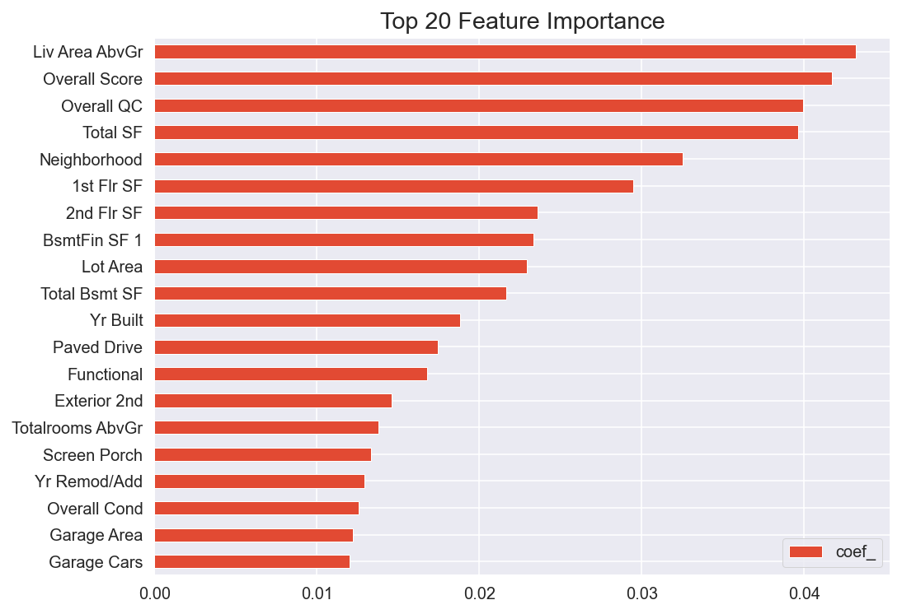

# Project 2 - Ames Housing Data and Kaggle Challenge

___
Problem Statement
---
`Situation and Complication`
* Alan Walker is a single , aspiring , working mid-profession currently living in Ames City. Like many of his peers in the working profession archetype, he is at a crossroad where he is looking to sell off his current house, so that he have sufficient capital to relocate to a bigger house to establish his new and impending growing family.
* Facing the financial challenge from their upcoming major life events (weddings , kids , new house, etc) , they often troubled over ways to optimise the selling price of their current house so as to lessen the finanicial burden arising from these events.

`Question (Problem Statement)`
* As a specialist in an established property and interior design team in Millenium Walk, how might we be able to use our housing prediction models to provide advise to house seller on which features to improve within their renovation spending budget , so that they are able to optimise their selling price between 5% to 10% from their current baseline Sale Price.

## Table of contents
* [Fast Fact on Ames City](#General-Info)
* [Datasets and Data Dictionary](#Data-Dictionary)
* [Buidling our Regression Models](#Model)
* [What those number tell us and how we used them for our Business Case?](#Summary)
* [Key House Feature Observation from Models](#Observation)
* [Applying Models on Client's Business Case](#Application)
* [Conclusion & Next Step](#Conclusion)

## Fast Fact on Ames
[(back to top)](#content_page)

[AMES City Quickfact from US Census Bureau](https://www.census.gov/quickfacts/amescityiowa)

## Datasets and Data Dictionary
[(back to top)](#content_page)

The data used for this project are from the following sources:
- DataSet :[AMES Housing Dataset](https://www.kaggle.com/c/dsi-us-11-project-2-regression-challenge/data)
- Data Dictionary:[AMES Housing Set Dictionary](http://jse.amstat.org/v19n3/decock/DataDocumentation.txt)
- Training Dataset : 2051 Rows x 81 Features
- Test Dataset : 878 Rows x 80 Features
- Test Dataset for Business Case : 70 Rows x 80 Features , 25 Rows x 80 Features

## Buidling our Regression Models
[(back to top)](#content_page)
* Linear Regression
* Lasso Regression
* Ridge Regression
* ElasticNet
* Random Forest Regression

|  | LR Score | Lasso Score | Ridge Score | Elastic Net | RandomForest Score |
|---|---|---|---|---|---|
| Training MAE | 0.075675 | 0.076120 | 0.075868 | 0.076094 | 0.035783 |
| Validation MAE | 0.075682 | 0.074083 | 0.074132 | 0.073673 | 0.075893 |
| Training RMSE | 0.104065 | 0.104905 | 0.104630 | 0.104878 | 0.052334 |
| Validation RMSE | 0.097977 | 0.095820 | 0.095426 | 0.095157 | 0.103696 |
| Training Model Score | 0.930951 | 0.929832 | 0.930199 | 0.929868 | 0.982537 |
| Validation Model Score | 0.933157 | 0.936069 | 0.936593 | 0.936950 | 0.925127 |

## What those number tell us and how we used them for our Business Case?
[(back to top)](#content_page)
* 4 of 5 models performed relatively well with respect to the Validation Dataset , generally not overfitting (Except for RF).
* Validation RMSE in the range of 0.093 - 0.104. This means that on average, the predicted value will be 9.74% - 10.9% away from the actual results.
* On Average, the predicted value will be $17810 to $18840 away from the actual results , depending on the model used.
* Putting these numbers in perspective:
    - AMES Median House Value is $205,900.
    - Mean Sale Price from our dataset is $187,000.
    - For the Business Case studies , our client Current House Value is forecasted at $277,000.
* These numbers give us a high confidence in our models to be used for business case studies. In this study, we will use our Rigde Model to advise our client.

## Key House Feature Observation from Models
[(back to top)](#content_page)

- Base on our model , there are many features that have strong correlation with respect to the Sale Price. However in the **standpoint of a seller in our business study** , many of these numeric feature are already cast in stone and not wise to varies (Size related features : House Size , Lot Area)

- Instead , we will study into features that could be physically implemented and improved upon such as House QC and cond , Garage QC and cond , Kitchen QC, etc.

    

## Applying Models on Client's Business Case
[(back to top)](#content_page)

1. We establish the baseline score for our client model, in this example , the key features as show:

| Client's Current House Info | Description |
|---|---|
| Neighborhood | NridgHT |
| House Style  | 2 Story |
| Living Area  | 1,904 SF |
| Functional  | Typical |
| Air Con  | Yes |
| Current House Cond | 5 |
| Current House QC | 8 |
| Current Garage Cond | Typical Average |
| Current Garage QC | Typical Average |

2. Using our Model , we are able to demonstrate the qualitative impact of improving a feature score ; in this Business Case , the house and garage condition.
3. Base on our client's renovation budget , we had proposed him to improve his house and garage condition and advised the corresponding impact. That is a predicted 9% and 3% increase in Sale Price respectively by taking action individually on this feature.

| House Cond (Client's Current) | House QC (Client's Current) | Predicted Sale Price  (Current) |
|:---:|:---:|:---:|
| 8 | 5 | $277,000 |
| House Cond (Proposed) | House QC (Proposed) | Predicted Sale Price  (Proposed) |
| 9 | 6 | $298,000 |

| Garage Cond (Client's Current) | Garage QC (Client's Current) | Predicted Sale Price  (Current) |
|:---:|:---:|:---:|
| 8 | 5 | $277,000 |
| Garage Cond (Proposed) | GarageQC (Proposed) | Predicted Sale Price  (Proposed) |
| 9 | 6 | $285,000 |

4. So what if our client had more budget? Well we could give him a range of option to consider.
5. Given sufficient discussion time , we could also explore more feature and advise our client accordingly.

    
     
    

## Conclusion & Next Step
[(back to top)](#content_page)

* With our model low RMSE error and good performance in predicting the Sale Price from the features (Not overfitting), this model is able to give an accurate qualitative overview to our client the potential in improving their house features before selling off.
* While we are able to predict qualitatively , we should also take into account that to improve a house feature, renovation budget will be required. Whether that outweighs the increase of SalePrice is not covered in this studies.
* Further ROI component , where it take in both renovation cost , as well as expected increase in Sale Price could be further study so that client is able to make a more informed decision before taking physical action.

